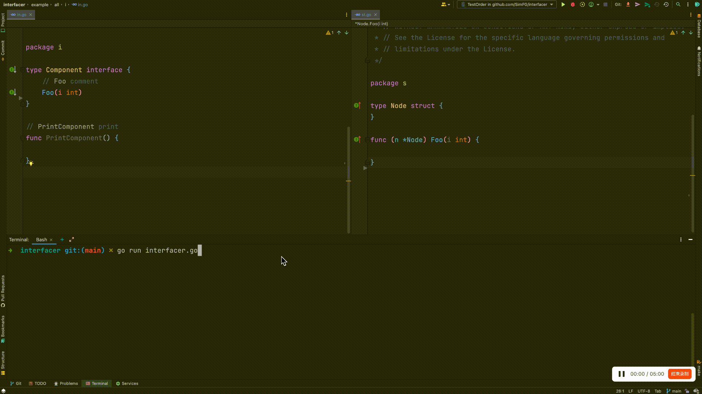

# Interfacer
[中文文档](README_CN.md)

Implement new methods in the interface everywhere

**Tips**: some problems may be encountered during use, as the tool is currently under development.

## Have you ever encountered such a problem
When you add a method to an interface, the corresponding implementation cannot be found after adding the method. 
Because of the addition of an additional method, the previous implementations are all invalid. 
In general, adding a method to an interface is cumbersome and time-consuming.

## Effect


## Getting started
### install
```shell
go install github.com/SimFG/interfacer
```

### Parameter description
There are two ways to set parameters, which are:
1. yaml file
```yaml
project_dir: "/Users/derek/fubang/interfacer/example/all"
project_module: "github.com/SimFG/interfacer/example/all"
interface_full_name: "github.com/SimFG/interfacer/example/all/i.Component"
new_method: "Hello(f int64) (int, error)"
return_default_values: "0,nil"
write_paths:
  - "github.com/SimFG/interfacer/example/proxy/all/s.Node,/Users/derek/xxx/interfacer/example/all/s/st.go"
```
2. command params
```bash
go run interfacer.go
    --project-dir=/Users/derek/fubang/interfacer/example/all
    --project-module=github.com/SimFG/interfacer/example/all 
    --interface=github.com/SimFG/interfacer/example/all/i.Component 
    --method="Hello(f int64) (int, error)" 
    --returns="0,nil"
```
- project dir: full project dir
- project module: it can be found in the `go.mod` file
- interface: the interface you want to add a new method to it. And its full name is required
- method: declaration of the newly added method
- returns: the default return values of new method

### Source build
1. clone the repository
```shell
git clone github.com/SimFG/interfacer
```
2. run
```shell
go run interfacer.go
```

## TODO
- Dealing with generated code out of order of comments
- Handle some special struct or interface
- Check the input params
- More readable codes