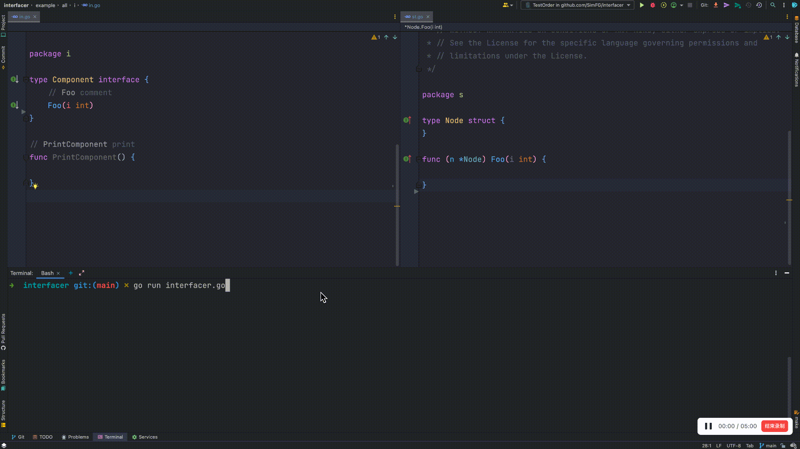

# Interfacer
在所有地方实现接口中新添的方法
**注**：使用过程中可能会遇到一些问题，因为工具目前正处于开发阶段

## 遇到过这样的问题吗
当你往一个接口添加一个方法时，添加方法后无法找到相应的实现。因为额外添加了一个方法，之前的实现都全部失效了。总的来说，给一个接口添加一个方法是非常麻烦且耗时。

## 效果图

## 开始

## TODO
- 生成代码导致注释乱序
- 调整结构