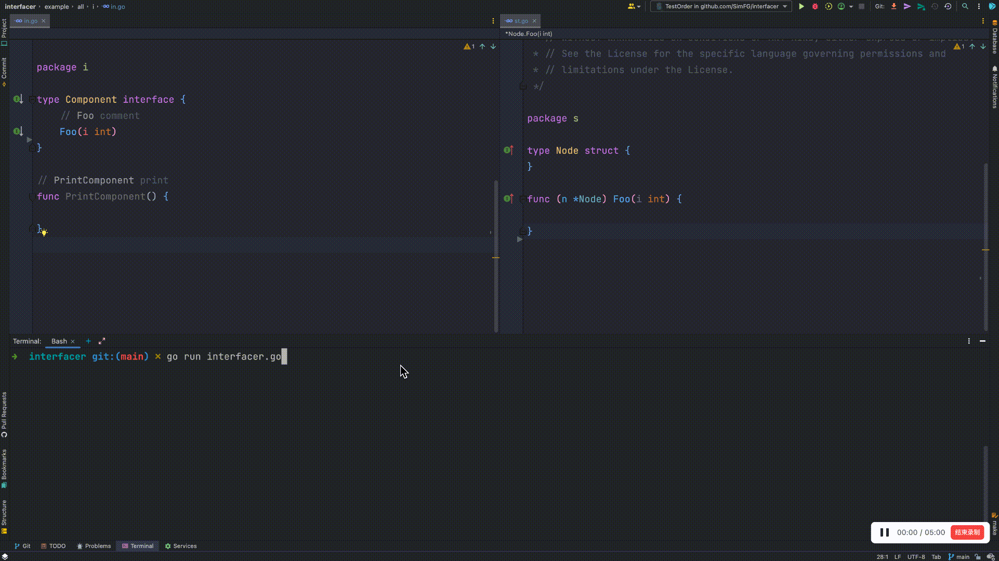

# Interfacer

快速给现有接口添加新方法，给相关结构**自动生成默认实现**


## 🎉 效果图



## 🐣 项目由来

当给接口添加一个方法时，该接口实现类存在许多，这时候不得不给所有实现添加其实现。
当然如果前期考虑到一些架构上的设计，接口会存在一个基础实现类，然后其他的实现都会包含这个基础实现类，这样在接口中添加新方法的时候就很方便。
但是如果要给所有的实现都加上新方法的时候，就会费不少力，且比较麻烦。

## 📚 开始

### 安装

有三种方法获得该工具，分别是：
1. 通过 [链接](https://github.com/SimFG/interfacer/blob/main/interfacer?raw=true) 下载，这个获取的是master分支上的最新版本。

2. 通过go命令下载

    ```shell
    go install github.com/SimFG/interfacer
    ```
3. 源码编译

    a. 下载源码
    ```shell
    git clone github.com/SimFG/interfacer
    ```
   b. 构建
   ```
   go  build interfacer.go interfacer_handle.go
   ```

### 🔬 使用详情

参数设置有两种方法，分别是：yaml文件和命令行参数。样例如下：
1. yaml 文件
    ```yaml
    project_dir: "/Users/derek/fubang/interfacer/example/all"
    project_module: "github.com/SimFG/interfacer/example/all"
    interface_full_name: "github.com/SimFG/interfacer/example/all/i.Component"
    new_method: "Hello(f int64) (int, error)"
    return_default_values: "0,nil"
    write_paths:
      - "github.com/SimFG/interfacer/example/proxy/all/s.Node,/Users/derek/xxx/interfacer/example/all/s/st.go"
    exclude_dirs:
      - "foo"
    enable_debug: false
    enable_record: false
    sub_modules:
      -
        project_dir: "/Users/derek/fubang/interfacer/example/implemente"
        project_module: "github.com/SimFG/interfacer/example/implemente"
        interface_full_name: "github.com/SimFG/interfacer/example/implemente/typee.Node"
        method: "GetStatic()"
        exclude_dirs:
          - "coord"
    ```
2. 命令行参数

    ```bash
    ./interfacer
        --project-dir=/Users/derek/fubang/interfacer/example/all
        --project-module=github.com/SimFG/interfacer/example/all 
        --interface=github.com/SimFG/interfacer/example/all/i.Component 
        --method="Hello(f int64) (int, error)" 
        --returns="0,nil"
    ```
   
参数含义
- project dir: 项目绝对路径
- project module: 项目模块名称，可以在`go.mod`中找到
- interface_full_name: 需要添加方法的接口全路径
- method: 方法声明
- returns: 方法返回值默认值列表
- exclude dirs: 在扫描的过程中忽略的路径列表
- enable_debug: 是否开启debug日志，打开会导致生成结果变慢，因为需要输出日志到文件中
- enable_record: 获取项目中所有结构和接口的关系，并将关系输出成文件
- sub_modules: 第三方模块配置；当第三方模块接口存在变更，同时项目需要升级版本，就可以进行相关配置，就可自动生成相关的实现，比如rpc service添加新的方法

### 🪧 提示

如果使用过程中发现什么问题，或者有什么好的想法，欢迎提issue。

## 🧭 计划蓝图
- 处理生成代码导致代码注释乱序
  - 接口 ✅
  - 结构
- 忽略文件或者文件夹
  - 精确匹配 ✅
  - 模糊匹配
- 调试模式，打印详细的程序运行过程 ✅
- 保证生成的方法不重复 ✅
- 支持第三方模块接口，该类接口新添方法也可以给项目生成相应的默认实现 ✅
- 校验输入参数 ✅
- 自定义yaml配置文件路径 ✅
- 更新中文文档 ✅
- 动态显示程序运行时间 ✅
- 展示扫描进度 ✅
- 处理没有名称的方法，如：`foo(bool)`
- 是否需要为接口中的新方法添加换行
- 如果新的方法在当前结构的内部接口或者接口中已经存在，支持配置是否添加新的方法
- 单独为多个第三方接口多个方法添加一个方法的默认实现
- 通过读取文件的方式写入方法的默认实现
- 处理多个相同类型参数的方法，如：`foo(a, b bool)`
- Idea插件
- 自定义生成代码的位置
- 通过模版，支持生成复杂的方法默认实现
- 支持一次性添加多个方法
- 更加合理、具有更强可阅读性的代码结构
- 新添加的方法参数或者返回值，处理未导入的结构或者接口
- 处理特殊的结构和接口
- 更通用的读和写go源文件的封装库
- ast案例教程